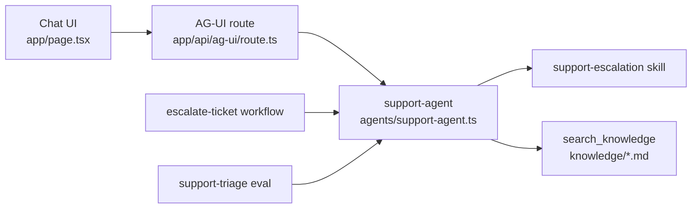

# Customer Operations Agent

A Veryfront Code example for building, evaluating, and deploying a customer operations agent.

It includes a chat surface, an agent, approved knowledge, a reusable skill, a workflow, evals, and a deploy path to Veryfront Cloud.

Use it as a starting point for support escalation agents, customer operations agents, or any agent that needs to answer from approved runbooks and produce grounded next actions.

## What it demonstrates

- A streaming chat UI backed by an AG-UI route
- A `support-agent` that can use project skills and tools
- OKF Markdown knowledge in `knowledge/`
- The standard `search_knowledge` tool for local and Cloud runs
- An `escalate-ticket` workflow for support escalation
- A `support-escalation` skill that defines the triage process
- An eval suite for retrieval quality, tool reliability, groundedness, and model comparison
- A Veryfront Cloud deploy path using the same project files

## How it works



The runtime surface is intentionally small:

- `app/page.tsx` renders the Veryfront chat component.
- `app/api/ag-ui/route.ts` exposes `support-agent` over AG-UI.
- `agents/support-agent.ts` defines the agent, attaches the skill, and enables tools.

Around that runtime, the project adds source-controlled knowledge, repeatable workflow steps, and evals that prove the agent retrieves the right runbooks before it answers.

## Project structure

```
app/
  page.tsx                    Chat interface
  api/ag-ui/route.ts          AG-UI endpoint for support-agent
agents/
  support-agent.ts            Agent definition
knowledge/
  *.md                        Approved OKF runbooks
tools/
  search-knowledge.ts         Standard search_knowledge tool
workflows/
  escalate-ticket.ts          Multi-step escalation workflow
skills/
  support-escalation/SKILL.md Triage instructions and output format
evals/
  support-triage.eval.ts      Retrieval and answer-quality eval
  datasets/support-triage.json Regression cases with expected knowledge
veryfront.config.ts           Project metadata
```

## Quickstart

```bash
npm install
npx veryfront routes
npm run build
npm run dev -- --port 3010
```

Open `http://localhost:3010`.

For live agent responses, log in to Veryfront or set provider credentials:

```bash
npx veryfront login
```

You can also set `VERYFRONT_API_TOKEN`, `OPENAI_API_KEY`, `ANTHROPIC_API_KEY`, or `GOOGLE_API_KEY`.

The app can build and expose routes without credentials. Chat responses, workflow agent steps, and eval runs need model access.

## Try the agent

Try support questions that map to the included runbooks:

- `Users cannot sign in with SSO after yesterday's deployment. Production support is blocked.`
- `The customer's renewal invoice failed payment, but the workspace is still active.`
- `A migration shipped this morning and users now see errors in the onboarding workflow.`
- `One support manager cannot access the correct workspace after changing browsers.`

The agent should search approved knowledge, separate facts from assumptions, identify the likely owner, and recommend the next customer-safe action.

## Knowledge

Source knowledge lives in `knowledge/` as Markdown with OKF frontmatter.

`tools/search-knowledge.ts` registers the standard `search_knowledge` tool with `createSearchKnowledgeTool()`. Local chat, local workflows, evals, and Cloud workflow runs use the same tool name and response shape.

For this demo, keep knowledge source-controlled. Do not run `veryfront knowledge ingest` unless you are intentionally moving the project to hosted platform knowledge. Mixing ingested copies with source files can return duplicate results.

## Run the workflow

```bash
npx veryfront workflow run escalate-ticket \
  --input '{"customer":"Acme Retail","subject":"SSO login failures after release","description":"Users cannot sign in with SSO after the latest deployment. Production support is blocked.","severity":"high"}'
```

The workflow searches approved project knowledge, asks `support-agent` to triage the issue, then drafts an escalation summary with scope, evidence, owner, and next action.

## Run evals

The eval suite checks whether the agent retrieves the right knowledge and keeps its answer grounded in that evidence.

This repo pins `veryfront@0.1.973`.

```bash
npx veryfront eval support-triage --json
```

Reports are written to timestamped folders under `.veryfront/evals/`. Use `--report-dir` only when CI needs a deterministic output path.

The suite includes these checks:

- `agent.calledTool("search_knowledge")`
- `agent.noFailedTools()`
- `knowledge.recallAtK`
- `knowledge.precisionAtK`
- `knowledge.mrr`
- `answer.groundedness`

Each dataset row declares `metadata.expectedKnowledge`, so retrieval quality is measured against the exact runbooks the case should use.

## Compare models

Use a strong baseline and explicit candidate models when optimizing for cost or latency.

```bash
npx veryfront eval support-triage \
  --baseline-model anthropic/claude-sonnet-4-6 \
  --candidate-model moonshotai/kimi-k2.6 \
  --json
```

The comparison report writes per-model results plus `comparison.json` and `comparison.md` in the timestamped report folder. It keeps `baselineModel` and `candidateModels` separate, shows gate failures, and includes gateway-sourced token and cost metadata when the run goes through Veryfront Cloud.

## Deploy

```bash
npx veryfront deploy --env preview --force
```

Cloud deploys the same project files. The hosted workflow can run `escalate-ticket` and resolve `search_knowledge` against the `knowledge/` files in this repository.

## Extend the example

1. Add or edit OKF runbooks in `knowledge/`.
2. Keep process instructions in `skills/support-escalation/SKILL.md`.
3. Add deterministic integrations under `tools/` when the agent needs to act.
4. Add workflows under `workflows/` for repeatable multi-step operations.
5. Add eval cases in `evals/datasets/support-triage.json` before changing agent behavior.
6. Run the eval suite before deploying or switching models.

Good changes keep the agent small and move reusable behavior into knowledge, skills, tools, workflows, and evals.
