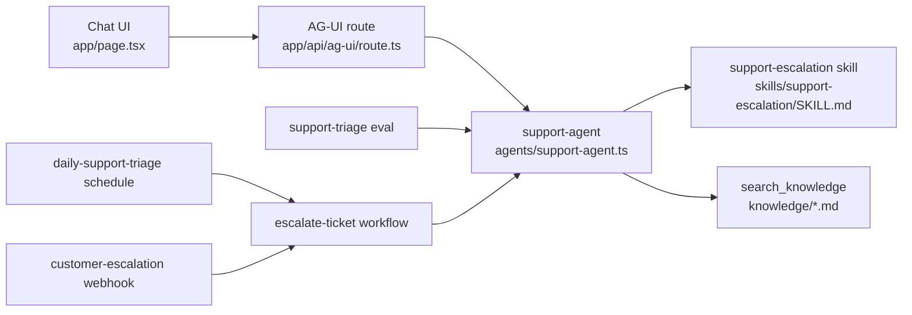

# Customer Operations Agent

A compact Veryfront Code example for a support escalation agent.

It shows how an agent definition, reusable skill, OKF knowledge, deterministic tool, chat UI, evals, workflow, source-defined triggers, and a Veryfront Cloud deploy path fit into one project.

Use it as a starting point for support escalation agents, customer operations agents, or any agent that needs to answer from approved runbooks and produce grounded next actions.

## What it demonstrates

- Agent: a `support-agent` definition with skills and tools enabled
- Skill: reusable `support-escalation` triage instructions
- Knowledge and tools: [OKF Markdown](https://veryfront.com/docs/cloud/knowledge) runbooks exposed through `search_knowledge`
- Chat: a streaming [AG-UI](https://docs.ag-ui.com/introduction) route and Veryfront chat component
- Quality: evals for retrieval, tool reliability, groundedness, and model comparison
- Operations: a workflow, schedule, and webhook that run locally and reconcile to Cloud
- Deploy: a Veryfront Cloud deploy path using the same project files

## How it works



The agent runtime is intentionally small:

- `agents/support-agent.ts` defines the agent, attaches the skill, and enables tools.
- `app/api/ag-ui/route.ts` exposes `support-agent` over AG-UI.
- `app/page.tsx` renders the Veryfront chat component.

Around that runtime, the project adds source-controlled knowledge, evals that prove the agent retrieves the right runbooks, and repeatable workflow steps for automation.

## Project structure

```
agents/
  support-agent.ts            Agent definition
skills/
  support-escalation/SKILL.md Triage instructions and output format
knowledge/
  *.md                        Approved OKF runbooks
tools/
  search-knowledge.ts         Standard search_knowledge tool
app/
  page.tsx                    Chat interface
  api/ag-ui/route.ts          AG-UI endpoint for support-agent
evals/
  support-triage.eval.ts      Retrieval and answer-quality eval
  datasets/support-triage.json Regression cases with expected knowledge
workflows/
  escalate-ticket.ts          Multi-step escalation workflow
schedules/
  daily-support-triage.ts      Weekday escalation review trigger
webhooks/
  customer-escalation.ts       Incoming urgent-issue trigger
fixtures/
  *.json                      Local workflow and trigger inputs
veryfront.config.ts           Project metadata
```

## Quickstart

```bash
npm install
npm run check
npm run dev -- --port 3010
```

Open `http://localhost:3010`.

For live agent responses, log in to Veryfront or set provider credentials:

```bash
npx veryfront login
```

You can also set `VERYFRONT_API_TOKEN`, `OPENAI_API_KEY`, `ANTHROPIC_API_KEY`, or `GOOGLE_API_KEY`.

The app can build and expose routes without credentials. Chat responses, eval runs, workflow agent steps, and trigger runs need model access.

## Agent primitives

`agents/support-agent.ts` keeps the agent definition small: it sets the agent ID, system prompt, `support-escalation` skill, tool access, and step limit.

`skills/support-escalation/SKILL.md` defines the triage process and limits the skill to `search_knowledge`, so escalation behavior can change without rewriting the agent or chat route.

Source knowledge lives in `knowledge/` as Markdown with OKF frontmatter. See the [Veryfront knowledge docs](https://veryfront.com/docs/cloud/knowledge) and [CLI knowledge ingestion guide](https://veryfront.com/docs/code/guides/cli-knowledge-ingestion) when importing or hosting knowledge outside the repo.

`tools/search-knowledge.ts` registers the standard `search_knowledge` tool with `createSearchKnowledgeTool()`. Local chat, evals, local workflows, and Cloud workflow runs use the same tool name and response shape.

## Try the agent

Try support questions that map to the included runbooks:

- `Users cannot sign in with SSO after yesterday's deployment. Production support is blocked.`
- `The customer's renewal invoice failed payment, but the workspace is still active.`
- `A migration shipped this morning and users now see errors in the onboarding workflow.`
- `One support manager cannot access the correct workspace after changing browsers.`

The agent should search approved knowledge, separate facts from assumptions, identify the likely owner, and recommend the next customer-safe action.

## Run evals

The eval suite checks whether the agent retrieves the right knowledge and keeps its answer grounded in that evidence.

This repo pins the `veryfront` version in `package.json` so eval reports and Cloud behavior stay reproducible.

```bash
npm run verify:eval
```

Reports are written to timestamped folders under `.veryfront/evals/`. Use `--report-dir` only when CI needs a deterministic output path.

The suite includes these checks:

- `agent.calledTool("search_knowledge")`
- `agent.noFailedTools()`
- `knowledge.recallAtK`
- `knowledge.precisionAtK`
- `knowledge.mrr`
- `answer.groundedness`

Each dataset row declares `metadata.expectedKnowledge`, so retrieval quality is measured against the exact runbooks the case should use.

## Compare models

Use a strong baseline and explicit candidate models when optimizing for cost or latency.

```bash
npx veryfront eval support-triage \
  --baseline-model anthropic/claude-sonnet-4-6 \
  --candidate-model moonshotai/kimi-k2.6 \
  --candidate-model openai/gpt-5.4-nano \
  --json
```

The comparison report writes per-model results plus `comparison.json` and `comparison.md` in the timestamped report folder. It keeps `baselineModel` and `candidateModels` separate, shows gate failures, and includes gateway-sourced token and cost metadata when the run goes through Veryfront Cloud.

## Run the workflow

```bash
npm run verify:workflow
```

The workflow searches approved project knowledge, asks `support-agent` to triage the issue, then drafts an escalation summary with scope, evidence, owner, and next action.

## Run source-defined triggers

Schedules and webhooks are source files, so they can be reviewed, tested, and deployed with the project.

```bash
npm run schedules
npm run verify:schedule
```

```bash
npm run webhooks
npm run verify:webhook
```

Both triggers target the same `escalate-ticket` workflow. Locally, the commands execute the workflow immediately. In Veryfront Cloud, deploy reconciliation creates or updates the hosted schedule and webhook from these files.

## Verify the project

Run structural checks that do not call a model:

```bash
npm run check
```

Run the full agent verification path:

```bash
npm run verify:agent
```

`verify:agent` builds the project, discovers routes, schedules, and webhooks, runs the eval suite, runs the workflow fixture, and runs both source-defined triggers. It requires Veryfront login or provider credentials.

## Deploy

```bash
npx veryfront deploy --env preview --force
```

Cloud deploys the same project files. The hosted workflow can run `escalate-ticket` and resolve `search_knowledge` against the `knowledge/` files in this repository.

Deploy reconciliation also syncs source-defined triggers:

- `schedules/daily-support-triage.ts` becomes a hosted weekday schedule.
- `webhooks/customer-escalation.ts` becomes a hosted webhook with a Cloud URL, secret, event history, and run history.

## Extend the example

1. Keep the agent definition small in `agents/support-agent.ts`.
2. Keep process instructions in `skills/support-escalation/SKILL.md`.
3. Add or edit OKF runbooks in `knowledge/`.
4. Add deterministic integrations under `tools/` when the agent needs to act.
5. Add eval cases in `evals/datasets/support-triage.json` before changing agent behavior.
6. Add workflows under `workflows/` for repeatable multi-step operations.
7. Add schedules or webhooks under `schedules/` and `webhooks/` when operations should run automatically.
8. Run the eval suite before deploying or switching models.

Good changes keep the agent small and move reusable behavior into skills, knowledge, tools, evals, and workflows.
