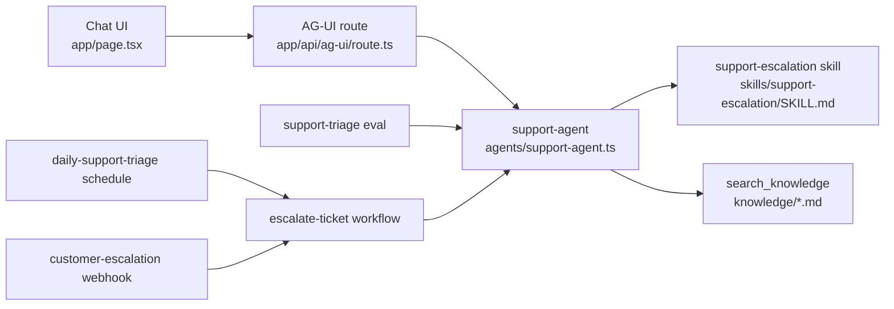

# Customer Operations Agent

A compact Veryfront Code example for a support escalation agent.

## Project overview

The folder structure mirrors the agent flow: build the agent primitives first, expose them through chat, validate with evals, then automate and deploy.



Read the diagram in this order:

1. `agents/support-agent.ts` defines the agent.
2. `skills/support-escalation/SKILL.md` gives the agent its triage process.
3. `tools/search-knowledge.ts` lets the agent search approved `knowledge/*.md` runbooks.
4. `app/` exposes the same agent through chat.
5. `evals/` checks retrieval, tool use, and grounded answers.
6. `workflows/` turns the same agent path into repeatable escalation work.
7. `schedules/` and `webhooks/` call the workflow automatically.
8. `veryfront.config.ts` keeps the same source deployable to Veryfront Cloud.

## Setup and run locally

Install dependencies:

```bash
npm install
```

Start the chat UI:

```bash
npm run dev -- --port 3010
```

Open `http://localhost:3010`.

For live agent responses, log in to Veryfront or set provider credentials:

```bash
npx veryfront login
```

You can also set `VERYFRONT_API_TOKEN`, `OPENAI_API_KEY`, `ANTHROPIC_API_KEY`, or `GOOGLE_API_KEY`.

## Build agent

| File | Purpose |
| --- | --- |
| `agents/support-agent.ts` | Agent ID, system prompt, skill, tool access, and step limit. |
| `skills/support-escalation/SKILL.md` | Escalation process and allowed `search_knowledge` tool. |
| `knowledge/*.md` | OKF Markdown runbooks. See the [knowledge docs](https://veryfront.com/docs/cloud/knowledge) and [CLI ingestion guide](https://veryfront.com/docs/code/guides/cli-knowledge-ingestion). |
| `tools/search-knowledge.ts` | Standard `search_knowledge` tool registered with `createSearchKnowledgeTool()`. |

Local chat, evals, workflows, and Cloud runs all use the same tool name and response shape.

## Use agent

Try runbook-backed support prompts:

- `Users cannot sign in with SSO after yesterday's deployment. Production support is blocked.`
- `The customer's renewal invoice failed payment, but the workspace is still active.`
- `A migration shipped this morning and users now see errors in the onboarding workflow.`
- `One support manager cannot access the correct workspace after changing browsers.`

Expected behavior: search approved knowledge, separate facts from assumptions, name the likely owner, and recommend the next customer-safe action.

## Eval agent

| Goal | Command | Notes |
| --- | --- | --- |
| Structural checks | `npm run check` | Builds the project and discovers routes, schedules, and webhooks. Does not call a model. |
| Eval suite | `npm run verify:eval` | Requires model credentials. Checks tool use, retrieval, and grounded answers. |
| Full local path | `npm run verify:agent` | Runs build discovery, evals, the workflow fixture, schedule trigger, and webhook trigger. |

Eval assertions include `agent.calledTool("search_knowledge")`, `agent.noFailedTools()`, `knowledge.recallAtK`, `knowledge.precisionAtK`, `knowledge.mrr`, and `answer.groundedness`.

Reports are written to timestamped folders under `.veryfront/evals/`. Each dataset row declares `metadata.expectedKnowledge`, so retrieval quality is measured against the runbooks the case should use.

Compare models with explicit baseline and candidate models:

```bash
npx veryfront eval support-triage \
  --baseline-model anthropic/claude-sonnet-4-6 \
  --candidate-model moonshotai/kimi-k2.6 \
  --candidate-model openai/gpt-5.4-nano \
  --json
```

The comparison report writes per-model results plus `comparison.json` and `comparison.md` in the timestamped report folder.

## Automate agent

| Goal | Command |
| --- | --- |
| Run the workflow fixture | `npm run verify:workflow` |
| Discover and run the schedule | `npm run schedules` then `npm run verify:schedule` |
| Discover and run the webhook | `npm run webhooks` then `npm run verify:webhook` |

The workflow searches approved knowledge, asks `support-agent` to triage, and drafts scope, evidence, owner, and next action.

Both triggers target the same `escalate-ticket` workflow. In Veryfront Cloud, deploy reconciliation creates or updates the hosted schedule and webhook from these source files.

## Deploy agent

```bash
npx veryfront deploy --env preview --force
```

Cloud deploys the same project files. The hosted workflow can run `escalate-ticket` and resolve `search_knowledge` against the `knowledge/` files in this repository.

## Extend project

| Change | Where |
| --- | --- |
| Keep the agent definition small. | `agents/support-agent.ts` |
| Keep process instructions in the skill. | `skills/support-escalation/SKILL.md` |
| Add or edit OKF runbooks. | `knowledge/` |
| Add deterministic integrations. | `tools/` |
| Add eval cases before changing agent behavior. | `evals/datasets/support-triage.json` |
| Add repeatable multi-step operations. | `workflows/` |
| Add automatic operations. | `schedules/` and `webhooks/` |

Run the eval suite before deploying or switching models.
