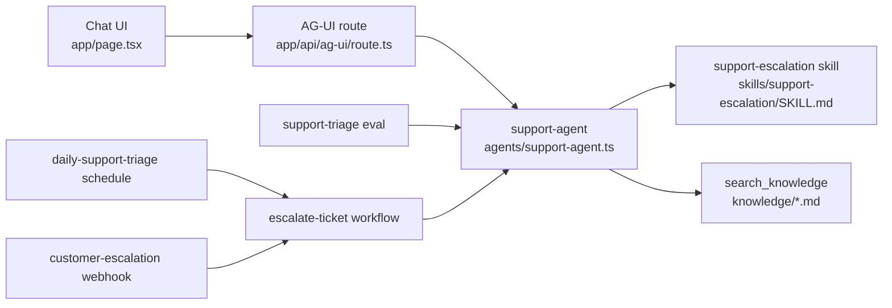

# Customer Operations Agent

A compact Veryfront Code example for a support escalation agent.

## Project overview

The folder structure mirrors the agent flow: build the agent primitives first, expose them through chat, validate with evals, then automate and deploy.



Read the diagram in this order:

1. `agents/support-agent.ts` defines the agent.
2. `skills/support-escalation/SKILL.md` gives the agent its triage process.
3. `tools/search-knowledge.ts` lets the agent search approved `knowledge/*.md` runbooks.
4. `app/` exposes the same agent through chat.
5. `evals/` checks retrieval, tool use, and grounded answers.
6. `workflows/` turns the same agent path into repeatable escalation work.
7. `schedules/` and `webhooks/` call the workflow automatically.
8. `veryfront.config.ts` keeps the same source deployable to Veryfront Cloud.

## Setup and run locally

Install dependencies:

```bash
npm install
```

Start the chat UI:

```bash
npm run dev -- --port 3010
```

Open `http://localhost:3010`.

For live agent responses, log in to Veryfront or set provider credentials:

```bash
npx veryfront login
```

You can also set `VERYFRONT_API_TOKEN`, `OPENAI_API_KEY`, `ANTHROPIC_API_KEY`, or `GOOGLE_API_KEY`.

## Build agent

- `agents/support-agent.ts`: agent ID, system prompt, skill, tool access, and step limit.
- `skills/support-escalation/SKILL.md`: escalation process and allowed `search_knowledge` tool.
- `knowledge/*.md`: OKF Markdown runbooks. See the [Veryfront knowledge docs](https://veryfront.com/docs/cloud/knowledge) and [CLI knowledge ingestion guide](https://veryfront.com/docs/code/guides/cli-knowledge-ingestion).
- `tools/search-knowledge.ts`: standard `search_knowledge` tool registered with `createSearchKnowledgeTool()`.

Local chat, evals, workflows, and Cloud runs all use the same tool name and response shape.

## Use agent

Try support questions that map to the included runbooks:

- `Users cannot sign in with SSO after yesterday's deployment. Production support is blocked.`
- `The customer's renewal invoice failed payment, but the workspace is still active.`
- `A migration shipped this morning and users now see errors in the onboarding workflow.`
- `One support manager cannot access the correct workspace after changing browsers.`

The agent should search approved knowledge, separate facts from assumptions, identify the likely owner, and recommend the next customer-safe action.

## Eval agent

Run structural checks before model-backed verification:

```bash
npm run check
```

Run the eval suite when model credentials are available:

```bash
npm run verify:eval
```

The suite checks:

- `agent.calledTool("search_knowledge")`
- `agent.noFailedTools()`
- `knowledge.recallAtK`
- `knowledge.precisionAtK`
- `knowledge.mrr`
- `answer.groundedness`

Reports are written to timestamped folders under `.veryfront/evals/`. Each dataset row declares `metadata.expectedKnowledge`, so retrieval quality is measured against the runbooks the case should use.

Run the full local verification path when credentials are available:

```bash
npm run verify:agent
```

`verify:agent` builds the project, discovers routes, schedules, and webhooks, runs the eval suite, runs the workflow fixture, and runs both source-defined triggers.

For model comparison, pass explicit baseline and candidate models:

```bash
npx veryfront eval support-triage \
  --baseline-model anthropic/claude-sonnet-4-6 \
  --candidate-model moonshotai/kimi-k2.6 \
  --candidate-model openai/gpt-5.4-nano \
  --json
```

The comparison report writes per-model results plus `comparison.json` and `comparison.md` in the timestamped report folder.

## Automate agent

Run the workflow directly:

```bash
npm run verify:workflow
```

The workflow searches approved knowledge, asks `support-agent` to triage, and drafts scope, evidence, owner, and next action.

Run the source-defined schedule and webhook locally:

```bash
npm run schedules
npm run verify:schedule
```

```bash
npm run webhooks
npm run verify:webhook
```

Both triggers target the same `escalate-ticket` workflow. In Veryfront Cloud, deploy reconciliation creates or updates the hosted schedule and webhook from these source files.

## Deploy agent

```bash
npx veryfront deploy --env preview --force
```

Cloud deploys the same project files. The hosted workflow can run `escalate-ticket` and resolve `search_knowledge` against the `knowledge/` files in this repository.

## Extend project

1. Keep the agent definition small in `agents/support-agent.ts`.
2. Keep process instructions in `skills/support-escalation/SKILL.md`.
3. Add or edit OKF runbooks in `knowledge/`.
4. Add deterministic integrations under `tools/` when the agent needs to act.
5. Add eval cases in `evals/datasets/support-triage.json` before changing agent behavior.
6. Add workflows under `workflows/` for repeatable multi-step operations.
7. Add schedules or webhooks under `schedules/` and `webhooks/` when operations should run automatically.
8. Run the eval suite before deploying or switching models.
