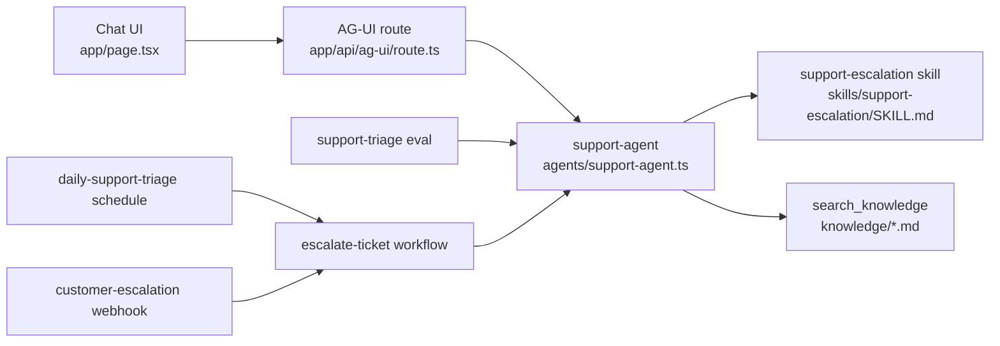

# Customer Operations Agent

A compact Veryfront Code example for a support escalation agent.

The project follows one path:

1. Define `support-agent` with a skill, OKF runbooks, and `search_knowledge`.
2. Expose the same agent through a streaming chat UI.
3. Validate retrieval and grounding with evals.
4. Reuse the agent in a workflow, source-defined triggers, and Veryfront Cloud deployment.

Use it as a starting point for support escalation agents, customer operations agents, or any agent that needs approved runbooks and grounded next actions.

## Quickstart

```bash
npm install
npm run check
npm run dev -- --port 3010
```

Open `http://localhost:3010`.

For live agent responses, log in to Veryfront or set provider credentials:

```bash
npx veryfront login
```

You can also set `VERYFRONT_API_TOKEN`, `OPENAI_API_KEY`, `ANTHROPIC_API_KEY`, or `GOOGLE_API_KEY`.

The app can build and expose routes without credentials. Chat responses, eval runs, workflow agent steps, and trigger runs need model access.

## How it fits together



| Step | Files | Purpose |
| --- | --- | --- |
| Build | `agents/`, `skills/`, `knowledge/`, `tools/` | Define the agent, its process, approved runbooks, and deterministic lookup tool. |
| Chat | `app/page.tsx`, `app/api/ag-ui/route.ts` | Expose `support-agent` through a Veryfront chat surface and [AG-UI](https://docs.ag-ui.com/introduction) route. |
| Validate | `evals/` | Check retrieval quality, tool reliability, and grounded answers before automation. |
| Automate | `workflows/`, `schedules/`, `webhooks/`, `fixtures/` | Run the same escalation path manually, on a schedule, or from webhook payloads. |
| Deploy | `veryfront.config.ts` and source files | Reconcile the same project files to Veryfront Cloud. |

## Build the agent

`agents/support-agent.ts` keeps the agent small: it sets the ID, system prompt, `support-escalation` skill, tool access, and step limit.

`skills/support-escalation/SKILL.md` defines the escalation process and limits the skill to `search_knowledge`, so triage behavior can change without rewriting the agent or chat route.

`knowledge/*.md` contains OKF Markdown runbooks. See the [Veryfront knowledge docs](https://veryfront.com/docs/cloud/knowledge) and [CLI knowledge ingestion guide](https://veryfront.com/docs/code/guides/cli-knowledge-ingestion) when importing or hosting knowledge outside the repo.

`tools/search-knowledge.ts` registers the standard `search_knowledge` tool with `createSearchKnowledgeTool()`. Local chat, evals, workflows, and Cloud runs use the same tool name and response shape.

## Try the chat UI

Try support questions that map to the included runbooks:

- `Users cannot sign in with SSO after yesterday's deployment. Production support is blocked.`
- `The customer's renewal invoice failed payment, but the workspace is still active.`
- `A migration shipped this morning and users now see errors in the onboarding workflow.`
- `One support manager cannot access the correct workspace after changing browsers.`

The agent should search approved knowledge, separate facts from assumptions, identify the likely owner, and recommend the next customer-safe action.

## Validate before automation

Run structural checks that do not call a model:

```bash
npm run check
```

Run the eval suite when model credentials are available:

```bash
npm run verify:eval
```

The suite checks:

- `agent.calledTool("search_knowledge")`
- `agent.noFailedTools()`
- `knowledge.recallAtK`
- `knowledge.precisionAtK`
- `knowledge.mrr`
- `answer.groundedness`

Reports are written to timestamped folders under `.veryfront/evals/`. Each dataset row declares `metadata.expectedKnowledge`, so retrieval quality is measured against the runbooks the case should use.

Run the full path when credentials are available:

```bash
npm run verify:agent
```

`verify:agent` builds the project, discovers routes, schedules, and webhooks, runs the eval suite, runs the workflow fixture, and runs both source-defined triggers.

To compare models, pass explicit baseline and candidate models:

```bash
npx veryfront eval support-triage \
  --baseline-model anthropic/claude-sonnet-4-6 \
  --candidate-model moonshotai/kimi-k2.6 \
  --candidate-model openai/gpt-5.4-nano \
  --json
```

The comparison report writes per-model results plus `comparison.json` and `comparison.md` in the timestamped report folder.

## Automate the agent

Run the workflow directly:

```bash
npm run verify:workflow
```

The workflow searches approved project knowledge, asks `support-agent` to triage the issue, then drafts an escalation summary with scope, evidence, owner, and next action.

Run the source-defined schedule and webhook locally:

```bash
npm run schedules
npm run verify:schedule
```

```bash
npm run webhooks
npm run verify:webhook
```

Both triggers target the same `escalate-ticket` workflow. In Veryfront Cloud, deploy reconciliation creates or updates the hosted schedule and webhook from these source files.

## Deploy

```bash
npx veryfront deploy --env preview --force
```

Cloud deploys the same project files. The hosted workflow can run `escalate-ticket` and resolve `search_knowledge` against the `knowledge/` files in this repository.

## Extend

1. Keep the agent definition small in `agents/support-agent.ts`.
2. Keep process instructions in `skills/support-escalation/SKILL.md`.
3. Add or edit OKF runbooks in `knowledge/`.
4. Add deterministic integrations under `tools/` when the agent needs to act.
5. Add eval cases in `evals/datasets/support-triage.json` before changing agent behavior.
6. Add workflows under `workflows/` for repeatable multi-step operations.
7. Add schedules or webhooks under `schedules/` and `webhooks/` when operations should run automatically.
8. Run the eval suite before deploying or switching models.
